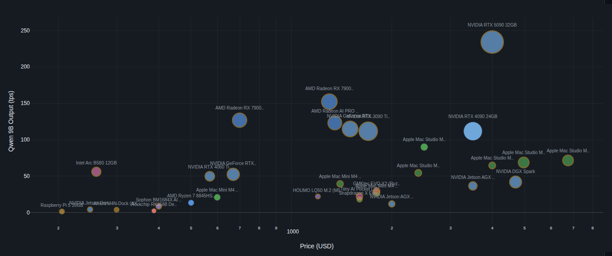

# AI Agent Local LLM Inference Device Deployment Guide

> Real data, no hype — A community-driven benchmark database for local LLM inference devices.

<p align="center">
  <a href="https://llmdev.guide"><strong>&gt;&gt;&gt; llmdev.guide &lt;&lt;&lt;</strong></a>
</p>

<p align="center">
  <a href="https://llmdev.guide"></a>
</p>

[中文版](README_zh.md)

## Why This Project?

AI Agents (Claude Code, Cursor, OpenClaw, [PicoClaw](https://github.com/sipeed/picoclaw), etc.) are becoming mainstream, but compared to simple chat, agent workloads consume massive amounts of tokens. Many users want to run LLMs locally for cost savings and data privacy.

However, the local inference device market offers a bewildering array of choices with complex specs, and is rife with **misleading and inflated marketing claims**. Users can easily overpay for hardware that fails to meet their expectations.

**This project aims to harness the power of the open-source community to collect real-world LLM inference performance data**, helping users make sound local LLM deployment decisions. **Join the discussion on [Discord](https://discord.gg/ved6aJmZQn)!**

Note: This project focuses on guiding individual users to select local LLM inference devices capable of running AI Agents. Listed devices must be able to run at least a 9B model, and are generally priced under $10,000.

Common compute inflation tactics in device marketing (see the Deployment Guide on the website for details):

| Tactic | Description | Inflation |
|--------|-------------|-----------|
| Sparse compute as default | Using sparsity TOPS as headline number | 2x |
| Low-precision compute | Using FP4/INT4 instead of INT8/FP16 | 2~4x |
| Heterogeneous compute stacking | Summing CPU + DSP + NPU compute directly | Difficult to co-utilize |
| Multi-chip memory/compute stacking | Adding memory/compute across chips connected by slow (<8 GB/s) interconnect | Depends on interconnect speed |
| High compute, low bandwidth | High TOPS but severely insufficient memory bandwidth | Model-dependent |

## Live Demo

Visit **[llmdev.guide](https://llmdev.guide)** to:

- **Leaderboard**: Rank devices by any single metric (decode speed, price-performance, power efficiency, etc.)
- **2D Scatter Plot**: Compare any two parameters with bubble size mapping
- **3D Scatter Plot**: Three-dimensional interactive comparison
- **Data Table**: Full device specs and benchmark data
- **Deployment Guide**: Model recommendations, spec evaluation tips, and device suggestions by budget

## Benchmark Standard

### Reference Models

We use the **Qwen3.5** model family as the unified benchmark:

| Model | Required | Notes |
|-------|----------|-------|
| Qwen3.5-9B | Required | Small device baseline |
| Qwen3.5-27B | Required | Mid-range device baseline |
| Qwen3.5-35B-A3B (MoE) | Optional | MoE performance reference |
| Qwen3.5-122B-A10B (MoE) | Optional | Large memory device reference |
| Qwen3.5-397B-A17B (MoE) | Optional | Flagship device reference |

### Metrics

- **Decode speed** (tokens/s) — the most important metric for interactive use
- **Prefill speed** (tokens/s) — affects time-to-first-token
- Minimum quantization: **4-bit** (INT4/Q4)
- Devices lacking direct Qwen3.5 data may use estimates from similar models (marked with *)

### Bandwidth Ceiling Validation

Reported decode speeds are validated against the theoretical bandwidth ceiling:

```
Ceiling TPS = Memory Bandwidth (GB/s) × 0.9 / Model Weight Size (GB)
```

Values exceeding this ceiling are flagged as suspicious (⚠).

## Contributing

**We welcome real-world benchmark submissions from everyone!**

See the [Contributing Guide](CONTRIBUTING.md).

Quick steps:
1. Fork this repository
2. Copy `devices/_template.md` and fill in your device data
3. Include test evidence (screenshots, terminal output)
4. Submit a PR

## Local Development

```bash
# Build the data file
python scripts/build_data.py

# Local preview
cd docs && python -m http.server 8080
```

## License

This project is licensed under [CC BY-SA 4.0](https://creativecommons.org/licenses/by-sa/4.0/). Data is contributed by the community and provided for reference only.
