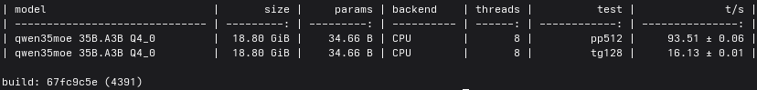
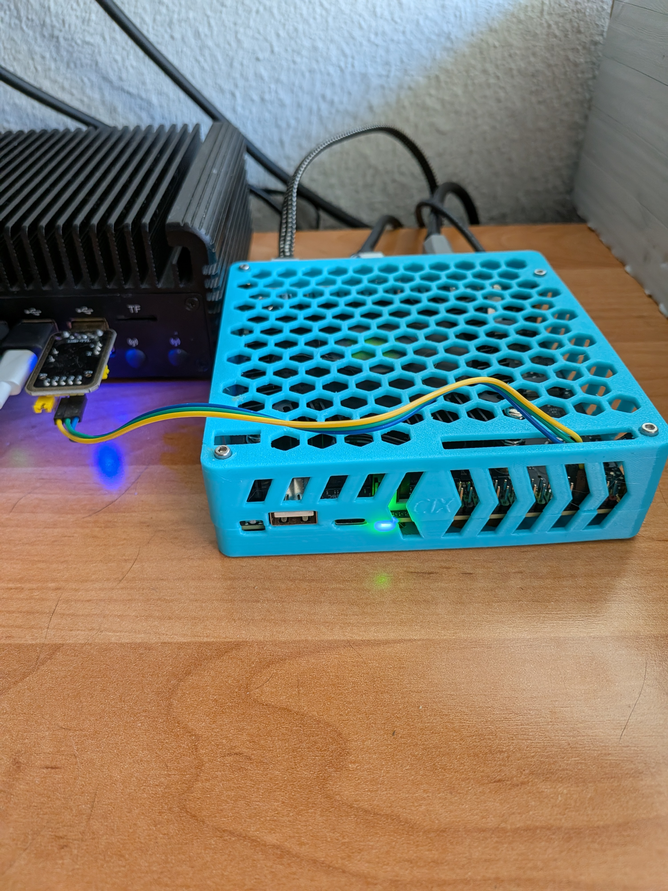

---
# ============================================================
# LLM Local Inference Device Benchmark - Data Template
# Copy this file and rename to: vendor-model.md (lowercase, hyphens)
# Example: nvidia-jetson-orin-nano-8gb.md
# ============================================================

# Basic info (required)
id: "radxa-orion-o6n-32gb"              # Unique ID, same as filename without .md
name: "Radxa Orion O6N"                 # e.g. "NVIDIA Jetson Orin Nano 8GB"
vendor: "Radxa"                         # e.g. "NVIDIA"
device_type: "Dev Board"                # Dev Board / GPU / Accelerator / Mini PC / Server

# Chip info (optional)
chip: "CIX P1 CD8180"                   # Main chip model

# Memory (required)
memory_capacity_gb: 32                  # Memory capacity in GB
memory_bandwidth_gbs: 96                # Memory bandwidth in GB/s

# Memory details (optional)
memory_type: "LPDDR5"                   # LPDDR4 / LPDDR5 / LPDDR5X / HBM3 etc.
memory_speed: "6000MT/s"                # e.g. 8533MT/s
memory_bus_width: "128bit"              # e.g. 256bit

# Claimed compute (optional — due to huge variance in vendor methodologies)
tops_int8: 30                                   # Claimed TOPS
tops_note: "NPU (official dokumentation 28,8)"  # Methodology: "GPU only" / "sparse" / "GPU+DLA" etc.

# Price & power (required)
price_usd: 199                          # Reference price in USD
power_watts: 31                         # Power consumption under load, in W

# Interface (optional)
interface: ""                           # PCIe x16 / USB-C / M.2 / Onboard etc.

# ============================================================
# LLM Benchmark Data (required — at least one Qwen3.5 model)
# ============================================================
benchmarks:
  - model: "Qwen3.5-35B-A3B"            # Model name
    quant: "int4"                       # Quantization: int4 / fp4 / int8 / fp8 / bf16 / f32
    framework: "ik_llama"               # Tool: ollama / llama.cpp / LM Studio / vendor SDK etc.
    decode_tps: "16.13"                 # Output speed in tokens/s (required)
    prefill_tps: "93.51"                # Prefill speed in tokens/s (optional)
    context_length:                     # Context length used (optional)
    image_encode_ms:                    # Image encode time in ms (optional, vision models only)

#  - model: "Qwen3.5-27B"
#    quant: "int4"
#    framework: "ollama"
#    decode_tps:

#  - model: "Qwen3.5-35B-A3B"          # Optional
#  - model: "Qwen3.5-122B-A10B"        # Optional
#  - model: "Qwen3.5-397B-A17B"        # Optional

# Submission info (required)
submitted_by: "Schnabulator"
date: "2026-04-04"
---

# Device Name — Benchmark Report

## Test Environment

- **OS**: SKY1 Linux (6.19.4-sky1-latest.r2)
- **Framework**: ik_llama build: 67fc9c5e (4391)
- **Model source**: https://huggingface.co/bartowski/Qwen_Qwen3.5-35B-A3B-GGUF (e.g. Hugging Face / Ollama library)
- **Cooling**: stock (stock / aftermarket / ambient temp)
- **Power supply**: 65W

## Results

(Additional details, multi-run results, different settings, etc.)

## Evidence

Place screenshots in `devices/assets/<device-id>/` directory.
For example, if your device id is `nvidia-rtx-4090-24gb`, put images in:
`devices/assets/nvidia-rtx-4090-24gb/`

Then reference them in this file with relative paths:

Accepted formats: `.jpg`, `.png`, `.webp`

## Device Photo

(Optional: photo of the actual device, placed in the same evidence directory)

## Notes

(Any additional information, known issues, special configurations, etc.)
measured_read_bandwidth: "~109 GB/s (8 threads, sysbench)"
measured_write_bandwidth: "~94,5 GB/s (8 threads, sysbench)"
